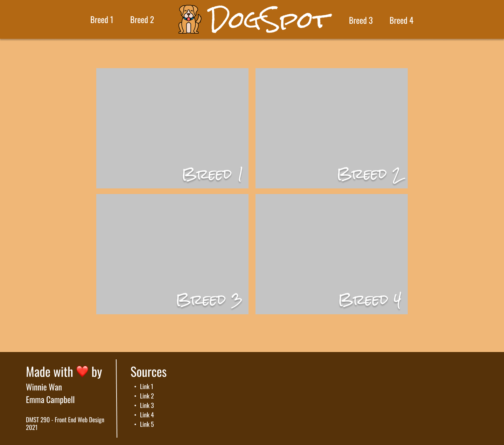
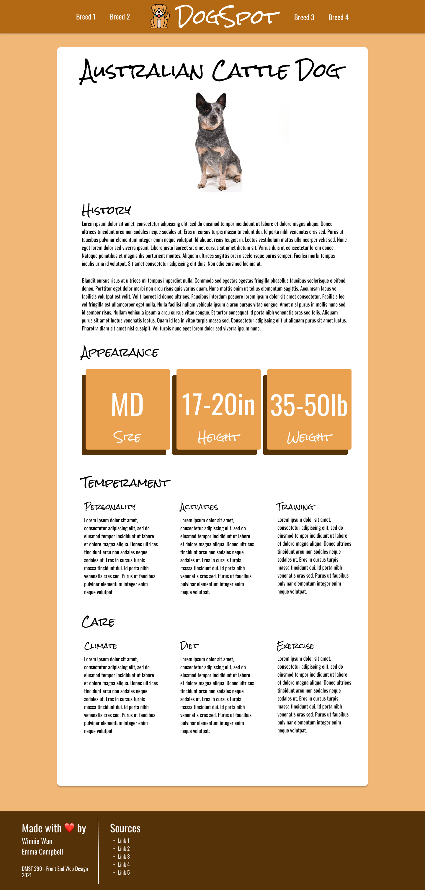

# DMST 290 - Project 4 Visual Design

Emma Campbell

April 30th, 2021

## Overall Goals

My overall goal with this site was to replicate the personality of a dog; that fun-loving, carefree personality that we all know and love. 

## Layouts

### Navigation

I decided to spice things up a little from a typical Z-Pattern, and include the logo and website name in the center of the navigation bar. I believe that this adds to the fun-loving theme of the website, because generally you find that more professional websites have their logo and name in the top left corner. This is just something fun, and different that adds to the wholistic themes of the website.

### Home Page

On the homepage, I did my best to replicate a Z-Layout, while still keeping true to the fun-loving and carefree themes of the website. I thought that it would be appropriate to include images of the dogs on the homepage, so that the user knows exactly what the dog looks like before reading more about the breed. In my mind, I invision an overlay that occurs when you hover over the image -- the image will darken, so that the text becomes more easily readable. The breed name will also overlay the image. 

### Breed Page

I wanted to make a long scrolly page, because that seemed most appropriate for the amount of content that we are trying to convey. I decided to center the breed name, along with the breed image at the top of the page, followed by two (ish) paragraphs about the breeds history.

To chunk up the reading, I made little abbreviation modules, that are representative of the breeds appearance. I wanted to prevent fatigue on the readers part, so I made these little modules short, sweet, and to the point. A break in the middle of the page from the heavy content.

After that, it was hard to make a decision on how I wanted to display the rest of the content. I noticed that each of the next two main categories: Temperament and Care, both had 3 subsections, so I decided to chunk it up again into 3 columns. I know that this can be easily done with bootstrap, but also makes it so the page isn't *too* long (I know it's still long, but this helps in my opinion).

## Color Palette

When designing the color palette, I tried to think of the first colors that game to mind when I thought of a dog. Many dogs have elements of orangey/brown in their coats, so I thought that it would be appropriate to center the palette around these orangey/brown tones. In fact, when I think of dogs, I tend to think of golden retrievers, which gave inspiration to much of the color palette. 

| Color Role                       | Hex Value                                                    |
| :------------------------------- | ------------------------------------------------------------ |
| Primary (Navigation)             | #B36813 |
| Secondary (Background Color)     | #F0B777 |
| Accent (Footer and Shadow Color) | #7D3D1A |
| Accent (Appearance Modules)      | #EAA250 |

## Typography

### Rock Salt (Headings)

[Rock Salt](https://fonts.google.com/specimen/Rock+Salt?category=Handwriting&preview.text=DogSpot&preview.text_type=custom#standard-styles) is a handwritten font -- according to the authors, was created with a felt-tip marker. I think the handwritten aspects of this fonts fits in well with the overall themes of "fun-loving" and "carefree". There aren't any serifs -- would would make the feel of the website "too classy" and unapproachable. I mean -- these are dogs we are talking about... man's best friend. 

### Oswald (Paragraphs)

[Oswald](https://fonts.google.com/specimen/Oswald?preview.text=Man%27s%20Best%20Friend&preview.text_type=custom&query=Oswald#standard-styles) is a sans-serif font that is both easy on the eyes and easily readible. It is thicker than other sans-serif fonts, which adds to the overall readibly. I think that this font contrasts nicely with Rock Salt -- Its more "too the point", which is different from the "fun"-ness that Rock Salt offers. However, its not too classy, that it takes away from the fun and carefree-ness of Rock Salt.

## Mockups

### Home Page

### Breed Page

 